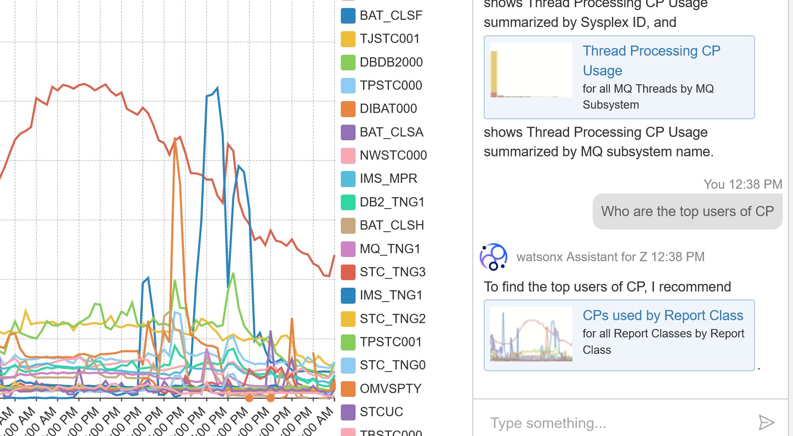
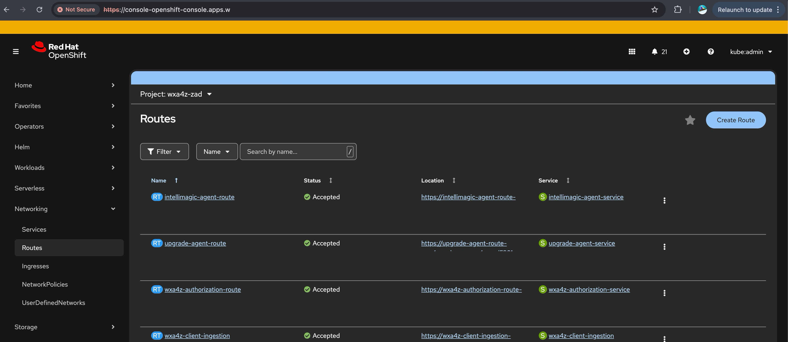

# IBM IntelliMagic agent for Z

A system that recommends IBM Z IntelliMagic Vision charts and
reports. These charts and reports show information on IBM Z systems,
from a performance and configuration perspective. The scope includes
the entire breadth of IBM Z IntelliMagic Vision reports,
including those for Db2, CICS, Storage Systems, Ficon Directors and IMS.
The recommendations are based on a user-provided topic or problem
description.

## Agent Capabilities

The basic feature set, available from WXA4Z, explains where you can find the recommended charts in IBM Z IntelliMagic Vision.
The preferred way of using the IBM IntelliMagic agent for Z is by using the integrated chat from IntelliMagic Vision.
In this setup, previews of the reports are available in the chat and all the previews are clickable links that automatically select the chart in IBM Z IntelliMagic Vision.



For more information on the integrated experience see [IBM Z IntelliMagic Vision for z/OS](https://www.ibm.com/docs/en/ibm-z-intellimagic).

## Prerequisites

- IBM Z IntelliMagic Vision version 1.1.2.4 or higher is installed.

## Install the IBM IntelliMagic agent for Z

IBM IntelliMagic agent for Z is part of the suite of WXA4Z agents.  You must configure all the shared variables, described in the section [wxa4z-agent-suite Chart - Global Settings](../../README.md#1-global-settings).

You must also setup two additional variables.  To enable the agent:

1. The `entitlementKey`, this allows the download of the agent.
2. The `AGENT_AUTH_TOKEN`, which is used to authenticate/register the agent with WXA4Z and IBM Z IntelliMagic Vision.
3. Enable the agent and accept the license.

### Retrieve the entitlement key

The entitlement key is shipped as part of IBM Z IntelliMagic Vision.
Enter the value of this key in the `intellimagic-agent` section of the `values.yaml` file in the `wxa4z-agent-suite` folder.
(See [values.yaml](../../wxa4z-agent-suite/values.yaml)).

```yaml:
intellimagic-agent:
  ...
  registry:
     name: intellimagic-image-pull-secret
     server: icr.io
     username: iamapikey
     entitlementKey: "<ENTITLEMENT_KEY>"
```

### Authentication of watsonx Assistant for Z to IBM IntelliMagic agent for Z

The agent access is controlled by an authorization token.   This token should ideally be generated by a token generation tool and should be hard to guess.
It is specified as the value of `AGENT_AUTH_TOKEN` in the shared `values.yaml` file (See [values.yaml](../../wxa4z-agent-suite/values.yaml)).

```yaml
intellimagic-agent:
  ...
  secrets:
    ...
        data:
           AGENT_AUTH_TOKEN: "<THE TOKEN>"
```

### Enabling the Agent and Accepting the License

The WXA4Z-suite install will only install the IBM IntelliMagic agent for Z if it is enabled and the license is accepted.
To enable IBM IntelliMagic agent for Z change the values of the following keys:

1. The `enabled` key should be set to `true`.
2. The `acceptLicense` key should be set to `true`.  Setting this to true implies that you agree to the license terms.  For more information on license terms and conditions, see [License](https://www.ibm.com/support/customer/csol/terms/?id=L-WZGZ-XWN8JA).

These values are available in the shared `values.yaml`  (See [values.yaml](../../wxa4z-agent-suite/values.yaml)).

```yaml
intellimagic-agent:
  enabled: false
  acceptLicense: false
```

## Deploy the agent

### Basic watsonx Assistant for Z deployment

1. Log in to watsonx Orchestrate.
2. From the main menu, navigate to **Build** > **Agent Builder**.
3. Select the **IBM IntelliMagic agent for Z** tile.
4. In the AI Assistant window, enter a query to confirm that the response aligns with your expectations.
5. Click **Deploy** to activate the agent and make it available in the live environment.

### Integrated deployment with IBM Z IntelliMagic Vision

Please note the following information:

1. The URL the agent is running at.  See section below how to retrieve this.
2. The `AGENT_AUTH_TOKEN` token configured above.

These values are used to configure IBM Z IntelliMagic Vision for the agent.
For more information on the configuration steps, see [IBM Z IntelliMagic Vision for z/OS](https://www.ibm.com/docs/en/ibm-z-intellimagic).


#### Getting the URL of the agent

To retrieve the URL where the agent is running, use the command line to
run the following command. Replace `<namespace>` with the namespace that you specified during [helm install](../../README.md#step-4-installupgrade).

```sh
oc get route -n <namespace> intellimagic-agent-route -o jsonpath='{.spec.host}'
```

You can also retrieve the URL using the web console for RedHat OpenShift.
In the _Networking_, go to the _Route_ section.   Select the `intellimagic-agent-route`.   The 
URL is the value in the _Location_ column.



## Image Signature Verification Guide

This container image of **IBM IntelliMagic agent for Z** is digitally signed to guarantee authenticity and integrity. Use the instructions below to verify the image signature with the provided files.

_Image reference:_  
`icr.io/ibm-intellimagic-agent/intellimagic-agent:1.1.0`

_Files provided:_  
- `PRD0014693key.pem.cer` – Certificate  
- `PRD0014693key.pem.chain` – CA chain  
- `PRD0014693key.pem.pub.key` – Public key  

---

### Prerequisites

Before you begin signature verification, ensure you have the following command-line tools installed:

*   **cosign:** For verifying the container signature.
*   **jq:** A lightweight and flexible command-line JSON processor.
*   **crane:** For inspecting image manifests.
*   **OpenSSL:** For cryptographic checks on the certificate and public key.

### Quick Verification

To verify the image signature, run the following command:

```sh
cosign verify --key PRD0014693key.pem.pub.key icr.io/ibm-intellimagic-agent/intellimagic-agent:1.1.0 | jq .
```

If the signature is valid, you'll see details about the signer and the certificate in the output.

---

### Optional: Detailed Verification Steps

For complete verification, including certificate checks and signature metadata, follow these steps:

#### 1. Check the signature manifest

Identify the signature manifest reference:

```sh
cosign triangulate icr.io/ibm-intellimagic-agent/intellimagic-agent:1.1.0
```

The output should look like this:
```sh
icr.io/ibm-intellimagic-agent/intellimagic-agent:sha256-<digest>.sig
```

You can inspect the signature details with:

```sh
crane manifest icr.io/ibm-intellimagic-agent/intellimagic-agent:sha256-<digest>.sig | jq .
```


---

#### 2. Ensure Public Key and Certificate match

Compare the public key and certificate by inspecting their modulus and exponent:

```sh
openssl x509 -in PRD0014693key.pem.cer -noout -text
openssl rsa -noout -text -inform PEM -in PRD0014693key.pem.pub.key -pubin
```

Look for the **Modulus** and **Exponent** values—these must match across both outputs.

---

#### 3. Verify Certificate Validity (Optional)

You can check if the provided certificate is valid using the Online Certificate Status Protocol (OCSP). This sends a request to the Certificate Authority (CA) to confirm the certificate is still valid.
```sh
openssl ocsp -no_nonce
-issuer PRD0014693key.pem.chain
-cert PRD0014693key.pem.cer
-VAfile PRD0014693key.pem.chain
-url http://ocsp.digicert.com
-respout ocsptest -text
```

If the certificate is valid, you should see the following message:

```
Response verify OK
```


