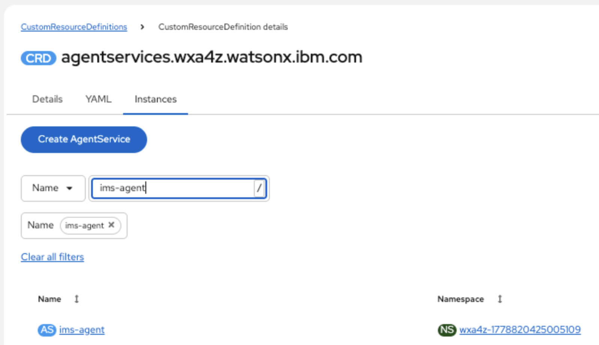
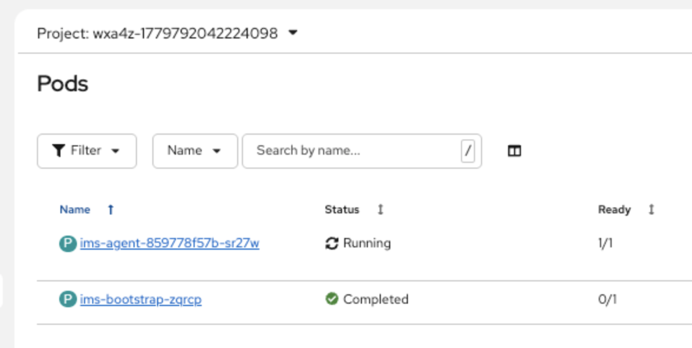

# IBM IMS Agents

## Overview

The IBM IMS Agents is a unified agent solution that combines question-answering capabilities with real-time system interaction. IMS Agents can answer general IMS command-related questions, such as the format or syntax of commands, and can provide insights into the operational state of IMS systems, which can help accelerate troubleshooting by streamlining diagnostics.

## Agent capabilities

| Agent capability            | Description                                                                                          | Tool name                                           |
| --------------------------- | ---------------------------------------------------------------------------------------------------- | --------------------------------------------------- |
| **General IMS Q/A**         | Answers general IMS related questions and provides documentation search.                             | ims_documentation_search<br/>ims_performance_search |
| **IMS commands**            | Explains syntax for IMS type-1, type-2, Connect WTOR, Connect zos, and DBRC commands.                                                  | get_command_syntax                                  |
| **IMS system**              | Displays active regions and data communication (DC) information for the IMS system.                  | ims_get_system_info                                 |
| **OTMA**                    | Displays IMS Open Transaction Manager Access (OTMA) status and connectivity.                         | ims_get_otma_info                                   |
| **TMEMBER**                 | Displays information about OTMA transaction members (TMEMBERs) and their transaction pipes (TPIPEs). | ims_get_tmember_info                                |
| **Pool**                    | Displays IMS storage pool utilization statistics and buffer usage.                                   | ims_get_pool_info                                   |
| **Transaction**             | Displays the status of IMS transactions.                                                             | ims_get_transaction_info                            |
| **Delayed response**        | Displays nodes with delayed transaction responses exceeding a timeout threshold.                     | ims_get_delayed_response                            |
| **Subsystem**               | Displays information about external subsystems connected to IMS (Db2, MQ, and so on).                | ims_get_subsys_info                                 |
| **Database**                | Displays the status and attributes of IMS databases.                                                 | ims_get_db_info                                     |
| **IMS Connect**             | Displays the current status and activity of IMS Connect (ICON).                                      | ims_get_ims_connect_info                            |
| **Shared queues structure** | Displays the status of IMS shared queues coupling facility structures.                               | ims_get_shared_queues_structure_info                |
| **CCTL**                    | Displays information about Coordinator Controllers (CCTLs) like CICS regions connected to IMS.       | ims_get_cctl_info                                   |
| **Resource error status**   | Displays the current error status of a specified IMS resource type.                                  | ims_get_resource_error_status                       |
| **Diagnostic SNAP**         | Collects diagnostic information and error details for IMS resources.                                 | ims_diag_snap                                       |
| **Program**                 | Displays the normal operating status of a specific program.                                          | ims_get_program_info                                |
| **OLDS**                    | Displays the system logging status.                                                                  | ims_get_olds_info                                   |
| **User**                    | Displays information about IMS user structures and user IDs.                                         | ims_get_user_info                                   |
| **SYSID transaction**       | Displays the IDs of the local and remote systems associated with a transaction.                      | ims_sysid_transaction                               |
| **Queue**                   | Displays IMS message queue status information.                                                       | ims_get_queue_info                                  |
| **Trace**                   | Displays IMS trace definitions or status.                                                            | ims_get_trace_info                                  |
| **CQS**                     | Displays the status of the IMS Common Queue Server (CQS).                                            | ims_get_cqs_info                                    |
| **PSB**                     | Displays which transactions the PSB is processing and which databases are accessed.                  | ims_get_psb_info                                    |
| **Queue count**             | Displays global queue count information for the specified resource type.                             | ims_display_qcnt                                    |
| **DBD**                     | Displays database type, accessing PSBs, and access types for databases being accessed.               | ims_dis_dbd                                         |
| **Overflow queue**          | Displays queue names that are in overflow mode for coupling facility structures.                     | ims_dis_overflowq                                   |
| **Area**                    | Displays data sets, status conditions, and databases associated with Fast Path DEDB areas.           | ims_dis_area                                        |

## Prerequisites

Review the [Deployment Guide](https://github.com/IBM/z-ai-agents/blob/main/README.md) to ensure IBM watsonx Assistant for Z is installed correctly.

> **Important:** All prerequisites listed below are required for correct agent operation. Missing or misconfigured dependencies will result in degraded functionality, failed tool calls, or responses that do not reflect the actual state of your z/OS environment.

Ensure the following are in place before installing the agent:

- [ ] **IMS 15.5 or later** installed. See [Installing IMS](https://www.ibm.com/docs/en/ims/latest?topic=installing-ims)
  - [ ] Order IMS 15.6 from Shopz to get the required entitlement key (installation of 15.6 is not required).
  - [ ] Ensure `CMDMCS` is not set to `N` in the DFSPBxxx member used to start IMS. Valid values that enable MCS/E-MCS console commands are `Y`, `R`, `C`, or `B`. See [mcs-console](https://www.ibm.com/docs/en/ims/15.6.0?topic=commands-using-multiple-console-support-mcs-consoles) and [cmdmcs](https://www.ibm.com/docs/en/ims/15.6.0?topic=parameters-cmdmcs-parameter-procedures).
- [ ] **z/OSMF 3.1 or later** installed and configured with a valid TLS certificate. See [IBM z/OS Management Facility](https://www.ibm.com/docs/en/zos/latest?topic=zos-management-facility)
- [ ] **IBM watsonx Assistant for Z** (ZAssistantDeploy) deployed to your OpenShift cluster. See [Deploying ZAssistantDeploy on your cluster](https://www.ibm.com/docs/en/watsonx/waz/3.3.0?topic=z-deploying-configuring-zassistantdeploy-your-cluster)
- [ ] **Multitenancy** configured with tenants created, users added, agents deployed, and agent subscriptions set up in the IBM watsonx Assistant for Z management console. See [Multitenancy in watsonx Assistant for Z](https://www.ibm.com/docs/en/watsonx/waz/3.3.0?topic=z-multitenancy-in-watsonx-assistant)
  - [ ] Before installing the IBM IMS Agents, ensure the target namespace (`wxa4z-<tenant_id>`) exists.
- [ ] **OpenSearch** deployed and running in your cluster (provisioned by ZAssistantDeploy). Required for the agent's question-answering capabilities. [Verify your ZAssistantDeploy Connection](https://www.ibm.com/docs/en/watsonx/waz/3.3.0?topic=cluster-testing-your-zassistantdeploy-connection).
- [ ] **Content ingestion** service deployed and running in your cluster (provisioned by ZAssistantDeploy). Required for ingesting documents into the search database. Credentials secret (`wxa4z-ingestion-credentials`) and NATS credentials (`nats-sys-account-credentials`, `nats-operator-credentials`) must be created before deployment. See [Ingesting your content](https://www.ibm.com/docs/en/watsonx/waz/3.3.0?topic=z-ingesting-your-content)
- [ ] **Authorization Service** deployed and running in your cluster (provisioned by ZAssistantDeploy). Required for all MCP tool calls to z/OS. See [Deploying the Authorization Service](https://www.ibm.com/docs/en/watsonx/waz/3.3.0?topic=cluster-deploying-zassistantdeploy-your#task_dth_5ns_pgc)
  - [ ] **Multi-SAF authorization** configured in the Authorization Service with your agent ID, context key, and z/OS connection details (URL, port, client cert, and key). See [Integrated authorization with multi-SAF support](https://www.ibm.com/docs/en/watsonx/waz/3.3.0?topic=z-integrated-authorization-multisaf-support)
- [ ] **Token Exchange Service** deployed and configured for PassTicket generation for your IMS APPL ID. See [Deploying the Token Exchange Service](https://www.ibm.com/docs/en/watsonx/waz/3.3.0?topic=z-deploying-token-exchange-service-passticket-generation)

## Optional: Verify image signatures

You can verify the container image signatures by setting a pull policy for your transport method. You must install Skopeo to use the examples in this documentation.

You can verify the signature for the following manifest:

- `icr.io/ibm-ims-ai/ims-agent:1.1.0`

Under the `ims-agent` directory, find the folder named `imagesign`, which contains a file named `public.pub.asc`. Place this file in a location of your choice. Then, copy the Docker container policy `policy.json` file into the `/etc/containers/policy.json` and update the `keyPath` field to reflect the location of your `public.pub.asc`.

```json
{
  "default": [
    {
      "type": "reject"
    }
  ],
  "transports": {
    "docker": {
      "icr.io": [
        {
          "type": "signedBy",
          "keyType": "GPGKeys",
          "keyPath": "/path/to/public.pub.asc"
        }
      ]
    },
    "docker-daemon": {
      "": [
        {
          "type": "reject"
        }
      ]
    }
  }
}
```

1. Log in to Skopeo:

   ```bash
   echo <PASSWORD_OR_TOKEN> | skopeo login --username <USERNAME> --password-stdin icr.io
   ```

2. Use Skopeo to copy the image. Make sure the transport method matches the transport that is used in the policy. This example uses `docker`:

   ```bash
   mkdir temp1
   skopeo copy docker://icr.io/ibm-ims-ai/ims-agent:1.1.0 dir:temp1
   ```

3. Import `public.pub.asc` into your local keyring:

   ```bash
   gpg --import /path/to/public_key.asc
   ```

4. Extract the fingerprint:

   ```bash
   export FINGERPRINT=$(gpg --fingerprint --with-colons | grep fpr | tr -d 'fpr:')
   ```

5. Validate the signature:

   ```bash
   skopeo standalone-verify ./temp1/manifest.json icr.io/ibm-ims-ai/ims-agent:1.1.0 $FINGERPRINT ./temp1/signature-1
   ```

If the image signature is valid and verified by `public.pub.asc`, the copy in step 2 will succeed. If the validation in step 5 is successful, you should see the following message:

```bash
Signature verified using fingerprint...
```

This is followed by the public key's fingerprint and the digest sha of the image. If a failure occurs, you might see this error:

```bash
FATA[0000] Error verifying signature: ...
```

## Install the IBM IMS Agents

The IBM IMS Agent is deployed using a Custom Resource (CR) definition. The CR provides a declarative way to manage the agent deployment through the [watsonx Assistant for Z operator](https://www.ibm.com/docs/en/watsonx/waz/3.3.0?topic=s390x-install-watsonx-assistant-z-operator).

### Before you begin

#### Check prerequisites

- Ensure the [watsonx Assistant for Z operator](https://www.ibm.com/docs/en/watsonx/waz/3.3.0?topic=s390x-install-watsonx-assistant-z-operator) is installed and running in the `wxa4z-zad` namespace/project on your cluster.
- Ensure the target namespace (`wxa4z-<tenant_id>`) exists.

#### Retrieve the entitlement key

When you install watsonx Assistant for Z, you should have acquired the entitlement key. However, if you need to retrieve it again, follow these steps:

1. Log in to [IBM Shopz](https://www.ibm.com/software/shopzseries/ShopzSeries_public.wss).
2. Place an order for IMS 15.6 in IBM Shopz to obtain the entitlement key, which is in the PDF document.

Create an instance from the CPD UI. It should give a tenant-id and also create a namespace with `wxa4z-<tenant-id>`.

#### Understand the required secret types

The agent uses several secrets of which there are two types: global and agent-specific.

- **Global secrets** (`wxa4z-watsonx-credentials`): Shared across all agents
  - See [Global settings](https://github.com/IBM/z-ai-agents/tree/main#1-global-settings). Ensure that this secret is present in the `wxa4z-zad` namespace and all of its fields are populated with valid values. When you deploy the IMS Agent it will draw values from this secret.
  - Optional: Certain variables are common across all agents. However, if any of these shared variables are also defined in your agent-specific configuration, the values specified in the values.env section of the custom resource file will override the shared ones. Additionally, the wxa4z-watsonx-credentials secret in the `wxa4z-<tenant-id>` namespace can be edited manually to update any value.
- **Agent-specific secrets** (`wxa4z-ims-agent-secrets`): Unique to this agent.
- **Agent pull secret** (`ims-image-pull-secret`): Unique to this agent. It contains the entitlement key and is used to pull the ims-agent image from the `icr.io` registry.

### Step 1: Create secrets

The agent requires Kubernetes Secrets that contain sensitive configuration values.

**Important**:

- Store certificates and secrets securely.
- Rotate tokens and secrets regularly.
- Never commit secrets to version control.


The agent supports two authentication modes for z/OSMF connections, controlled by `ZOSMF_AUTH_MODE`.

| Variable          | Default      | Description                                                                 |
| ----------------- | ------------ | --------------------------------------------------------------------------- |
| `ZOSMF_AUTH_MODE` | `basic`      | Authentication mode for z/OSMF: `basic` or `passticket`.                    |
| `ZOSMF_USERNAME`  | _(required)_ | z/OSMF user name. This is required when `ZOSMF_AUTH_MODE=basic`.                     |
| `ZOSMF_PASSWORD`  | _(required)_ | z/OSMF password. This is required when `ZOSMF_AUTH_MODE=basic`.                     |

**`basic` mode (default):** The agent authenticates to z/OSMF using a static
user name and password supplied by `ZOSMF_USERNAME` and `ZOSMF_PASSWORD`. Both
variables must be set; otherwise, startup will fail with an error if either is missing.

**`passticket` mode:** The agent obtains a one-time PassTicket at runtime for each
z/OS connection. `ZOSMF_USERNAME` and `ZOSMF_PASSWORD` are not required in this mode.
Use this mode in environments where static credentials are not permitted.

> **Important:** `ZOSMF_AUTH_MODE` is case-insensitive and defaults to `passticket` if an
> unrecognized value is provided.

#### Agent-specific secret reference (`wxa4z-ims-agent-secrets`)

1. Create a yaml file (for example, `ims-agent-secret.yaml`) with the following structure:

    ```yaml
    apiVersion: v1
    kind: Secret
    metadata:
      name: wxa4z-ims-agent-secrets
      namespace: ""  # REQUIRED: Must match the agent namespace
    type: Opaque
    data:
      AGENT_AUTH_TOKEN: ""  # REQUIRED: Agent auth token for registration with WxO
      ZOSMF_AUTH_MODE: "passticket"  # change to basic to use basic authentication
      ZOSMF_USERNAME: ""             # fill in when ZOSMF_AUTH_MODE=basic
      ZOSMF_PASSWORD: ""             # fill in when ZOSMF_AUTH_MODE=basic  
    ```

  

2. Deploy the secret to OpenShift:

    ```bash
    oc apply -f ims-agent-secret.yaml
    ```

3. Verify the secret was created:

    ```bash
    oc get secret wxa4z-ims-agent-secrets -n wxa4z-<tenant_id>
    ```

#### Creating the ICR pull secret (`ims-image-pull-secret`)

Run the following command to create an image pull secret for IBM Cloud Container Registry (ICR):

```bash
oc create secret docker-registry ims-image-pull-secret -n wxa4z-<tenandID> --docker-server=icr.io --docker-username=iamapikey --docker-password=‘<->’
```

Update the *docker-password* with the entitlement key and also update the *tenandID*.

### Step 2: Configure the cr.yaml file parameters and install agents

#### Configure the parameters (required)

The following table outlines the key configuration parameters in the cr.yaml file:

| Parameter | Description |
| ----------- | ------------- |
| **metadata.namespace** | Target namespace for agent deployment. |
| **spec.tenantId** | Tenant identifier for multi-tenancy support. |
| **spec.chart.version** | Helm chart version to deploy. |
| **spec.values.env.WATSONX_MODEL_ID** | LLM Model ID (for example, "meta-llama/llama-3-3-70b-instruct"). |
| **spec.values.env.MODEL_RUNTIME** | MODEL RUNTIME (for example, "openai_protocol"). |
| **spec.values.secrets.name** | Name of agent-specific secrets. |
| **spec.values.global.secrets.name** | Name of global shared secrets. |
| **spec.values.env.AUTHZ_BASE_URL** | Authentication service route in OCP wxa4z-zad namespace. |
| **spec.values.env.DEPLOYMENT_TYPE** | DEPLOYMENT TYPE (for example, "on-prem/openai_protocol"). |
| **spec.values.registry.entitlementKey** | Entitlement Key for pulling the agent image and helm package. |

Update all placeholder values marked as `REQUIRED` and save the configuration to a file (for example, `cr.yaml`):

```yaml
apiVersion: wxa4z.watsonx.ibm.com/v1alpha1
kind: AgentService
metadata:
  name: ims-agent
  namespace: ""  # REQUIRED: Target namespace (for example, wxa4z-<tenant_id>)
  labels:
    wxa4z.watsonx.ibm.com/managed-by: agent-operator
spec:
  releaseName: ims-agent
  namespace: ""  # REQUIRED: Must match metadata.namespace
  tenantId: ""   # REQUIRED: Tenant identifier for multi-tenancy support
  wxa4z-core-services-namespace: wxa4z-zad  # Namespace where wxa4z core services are deployed
  
  agentDetails:
    - agentName: ims
      agentId: wxa4z:ims:agent
      displayName: "IBM Z IMS Agent"
      description: "IMS AGENT helps to answer all IMS related questions"
      bootstrapConfig:
        name: ims-agent-bootstrap-config
        fileName: ims_agent_bootstrap_config.yaml
  
  chart:
    repository: oci://icr.io/ibm-ims-ai
    name: ims-agent
    version: "v1.1.0"  # Update to the desired chart version
    # Uncomment if using a private registry:
    # pullSecrets:
    #   - name: wxa4z-image-pull-secret

  values:
    replicaCount: 1
    
    global:
      secrets:
        name: wxa4z-watsonx-credentials  # Global secrets shared across agents
    
    secrets:
      name: wxa4z-ims-agent-secrets      # Agent-specific secrets
    
    env:
      # LLM Configuration
      WATSONX_MODEL_ID: "meta-llama/llama-3-3-70b-instruct" # REQUIRED: The id of the model you've configured to use
      MODEL_RUNTIME: "on_prem" # REQUIRED: Options are "on_prem", "openai_protocol", and "cloud"
      DEPLOYMENT_TYPE: ""      # REQUIRED: Options are "on_prem", "openai_protocol", and "cloud" (Must match MODEL_RUNTIME value)
      AUTHZ_BASE_URL: ""       # REQUIRED: Authorization Service route. Can be found in the `wxa4z-zad` namespace under "Routes"
    registry:
      entitlementKey: ""       # REQUIRED: The entitlement key you retrieved from Shop Z
```

#### Deploy the agent to OpenShift

1. Apply the cr.yaml file to your cluster:

    ```bash
    oc apply -f cr.yaml
    ```

2. Verify the deployment:

    ```bash
    # Check CR status
    oc get agentservice ims-agent -n wxa4z-<tenant_id>

    # Check the agent pods:
    oc get pods -n wxa4z-<tenant_id> -l app=ims-agent

    # View the agent logs:
    oc logs -n wxa4z-<tenant_id> -l app=ims-agent --tail=100
    ```

    A successful CR deployment looks like this:

    

### Step 3: Subscribe to the agent in the WXA4Z Management Console

After deploying the agent, wait 10 to 15 minutes for it to finish starting up. Once you confirm the deployment is successful, you need to subscribe to it in the WXA4Z Management Console to make it available in watsonx Orchestrate.

1. Open the Cloud Pak for Data (CPD) home page using your LDAP mapped credentials, for example:
   - `https://cpd-<instance>.apps.<cluster-domain>/zen/?context=icp4data#/homepage`

2. Click the **Launch the WXA4Z Management Console** tab.
   - This opens the WXA4Z Content Ingestion UI (Tenant Overview page), for example: `https://wxa4z-content-ingestion-ui-route-wxa4z-zad.apps.<cluster-domain>/en`

3. On the Tenant Overview page, click your **Tenant name** and navigate to the **Subscriptions** tab.
   - You see a list of deployed agents with a **Subscribe** button next to each.

4. Click the **Subscribe** button next to the **IBM Z IMS Agent**.
   - This action adds the agent to watsonx Orchestrate (WXO) and makes it available for deployment.

### Step 4: Deploy the agent

1. Log in to watsonx Orchestrate. From the main menu, click **Build** > **Agent Builder**.
2. Select the **IBM IMS Agent** tile and in the AI Assistant window, enter a query to confirm that the response aligns with your expectations.
3. Click **Deploy** to activate the agent and make it available in the live environment.

### Configure the IMS connections

You can use several API endpoints to connect to z/OS systems that an agent can pull information from:

- Endpoint for creating connections to IMS systems. This allows you to establish secure connections for executing IMS commands and operations.
- Endpoint for configuring agent settings, including z/OS system details and certificates.

**Important:** Always use HTTPS for API requests.

#### Create a connection for the z/OS system

You can add a connection for a z/OS system via REST API request to the authorization service URL (`AUTHZ_BASE_URL`). This URL can be found in the `wxa4z-zad` namespace in your OpenShift cluster under "Routes".

```text
POST <AUTHZ_BASE_URL>/api/v2/tenants/{tenant_id}/agents/{agent_id}/connections
```

**Path parameters:**

- `tenant_id`: Your tenant identifier (for example, `17700000005109`)
- `agent_id`: The agent identifier `wxa4z:ims:agent`, URL-encoded as `wxa4z%3Aims%3Aagent`.

**Variables:**

- `<AUTHZ_BASE_URL>`: Your authorization service base URL that you get from wxa4z-zad namespace, (for example: `https://wxa4z-authorization-route-namespace.apps.domain.com`)

#### Authentication: getting a bearer token to authenticate

Before you create a connection, you must obtain a bearer token from the authentication endpoint:

```text
GET <AUTHZ_BASE_URL>/api/v1/agents/{agent_id}/token
```

Include the bearer token in the `Authorization` header of your connection request:

```text
Authorization: Bearer <your_token>
```

#### Request body

The request body must be a JSON object with the following structure:

```json
{
  "data": {
    "agent_id": "wxa4z:ims:agent",
    "zos_url": "https://ec0000a.example.ibm.com",
    "application_id": "IZUDFLT",
    "port": 5443,
    "context": "ec0000a",
    "client_cert": "<base64_encoded_certificate>",
    "client_key": "<base64_encoded_key>",
    "tokchg_secret": "<token_exchange_secret>"
  }
}
```

**Field descriptions:**

| Field | Type | Required | Description |
| ------- | ------ | ---------- | ------------- |
| `agent_id` | string | Yes | The unique identifier for the IMS agent |
| `zos_url` | string | Yes | The base URL of your z/OS system |
| `application_id` | string | Yes | z/OSMF application ID (typically `IZUDFLT`) |
| `port` | integer | Yes | The port number for secure communication with the token exchange service (typically `5443`) |
| `context` | string | Yes | The context identifier for the z/OS system |
| `client_cert` | string | Yes | Base64-encoded client certificate for mTLS authentication |
| `client_key` | string | Yes | Base64-encoded client private key |
| `tokchg_secret` | string | Yes | Secret for token exchange service authentication |

#### Example request

```bash
# Set your authorization URL:
export AUTHZ_BASE_URL="https://wxa4z-authorization-route-namespace.apps.domain.com"

# Step 1: Obtain bearer token:
curl -X GET \
  "${AUTHZ_BASE_URL}/api/v1/agents/wxa4z%3Aims%3Aagent/token" \
  -H 'Content-Type: application/json'

# Step 2: Create connection:
curl -X POST \
  "${AUTHZ_BASE_URL}/api/v2/tenants/17700000005109/agents/wxa4z%3Aims%3Aagent/connections" \
  -H 'Authorization: Bearer <your_token>' \
  -H 'Content-Type: application/json' \
  -d '{
    "data": {
      "agent_id": "wxa4z:ims:agent",
      "zos_url": "https://ec0000a.example.ibm.com",
      "application_id": "IZUDFLT",
      "port": 5443,
      "context": "ec0000a",
      "client_cert": "...",
      "client_key": ".....",
      "tokchg_secret": "....."
    }
  }'
```

#### Create a configuration for the previous endpoint

The wxa4z Authentication service also provides an endpoint for configuring agent settings, including z/OS system details and certificates:

```text
POST <AUTHZ_BASE_URL>/api/v2/tenants/{tenant_id}/agents/{agent_id}/configs
```

**Path parameters:**

- `tenant_id`: Your tenant identifier (for example, `17700000005109`)
- `agent_id`: The agent identifier `wxa4z:ims:agent`, URL-encoded as `wxa4z%3Aims%3Aagent`.

**Variables:**

- `<AUTHZ_BASE_URL>`: Your authorization service base URL

#### Authentication: getting a bearer token to authenticate

This endpoint requires the same bearer token authentication as the connections endpoint. Obtain a token from:

```text
GET <AUTHZ_BASE_URL>/api/v1/agents/{agent_id}/token
```

#### Request body

The request body must be a JSON object with the following structure. For information on the 'cert' value, see [Configuring your z/OSMF certificate](https://github.com/IBM/z-ai-agents/blob/main/ims-agent/README.md#configuring-your-zosmf-certificate).

```json
{
  "agent_id": "wxa4z:ims:agent",
  "context": "ec0000a",
  "config": {
    "host": "https://ec0000a.example.ibm.com",
    "port": 10443,
    "console_name": "console name",
    "subsystem_id": "id value",
    "connect_jobname": "job name",
    "cert": "-----BEGIN CERTIFICATE-----\n...\n-----END CERTIFICATE-----"
  }
}
```

**Field descriptions:**

| Field | Type | Required | Description |
| ------- | ------ | ---------- | ------------- |
| `agent_id` | string | Yes | The unique identifier for the IMS agent |
| `context` | string | Yes | A context identifier for this configuration should be the **same value** as context in connection |
| `config.host` | string | Yes | The base URL of your z/OS system |
| `config.port` | integer | Yes | The port where the z/OSMF service is running on your z/OS system |
| `config.console_name` | string | Yes | The z/OS console name (for example, `oadm000a`) |
| `config.subsystem_id` | string | Yes | IMS subsystem instance ID (for example, `IMS1`) |
| `config.connect_jobname` | string | Yes | The job name of IMS Connect (for example, `HWS1`) |
| `config.cert` | string | Yes | PEM-formatted certificate for secure communication |

#### Example request

```bash
# Set your authorization URL:
export AUTHZ_BASE_URL="https://wxa4z-authorization-route-namespace.apps.domain.com"

# Step 1: Obtain the bearer token (if it is not already obtained):
curl -X GET \
  "${AUTHZ_BASE_URL}/api/v1/agents/wxa4z%3Aims%3Aagent/token" \
  -H 'Content-Type: application/json'

# Step 2: Configure agent settings. For information on the 'cert' value, see [Configuring your z/OSMF certificate](https://github.com/IBM/z-ai-agents/blob/main/ims-agent/README.md#configuring-your-zosmf-certificate).
curl -X POST \
  "${AUTHZ_BASE_URL}/api/v2/tenants/17700000005109/agents/wxa4z%3Aims%3Aagent/configs" \
  -H 'Authorization: Bearer <your_token>' \
  -H 'Content-Type: application/json' \
  -d '{
    "agent_id": "wxa4z:ims:agent",
    "context": "ec0000a",
    "config": {
      "host": "https://ec0000a.vmec.svl.ibm.com",
      "port": 10443,
      "console_name": "val",
      "subsystem_id": "id",
      "connect_jobname": "jobname",
      "cert": "-----BEGIN CERTIFICATE-----\n-----END CERTIFICATE-----"
    }
  }'
```

#### Response

A successful connection creation returns a `201 Created` status code with connection details in the response body.

#### Security guidelines

- Always use HTTPS for API requests
- Store certificates and secrets securely
- Rotate tokens and secrets regularly
- Never commit credentials to version control
- Use environment variables or secure vaults for sensitive data​

## Test your agent

After deployment, the agent becomes active and is available for selection in the live environment.

1. Log in to watsonx Orchestrate. From the main menu, click **Chat**.
2. Choose your agent from the list.
3. Enter queries using the AI Assistant, for example:

   ```text
   What is IMS TM?

   What is the IMS type-1 command to show the status of a transaction named xyz? use ec01182a

   Show me the status of my IMS system.
   ```

4. Verify that the responses returned by the AI assistant are accurate.



### Post-installation configuration

#### Ensure OpenSearch is deployed to your cluster

The IMS Agent relies on an instance of an OpenSearch vector database for question-answering capabilities. If OpenSearch is not already deployed to your cluster, follow instructions on how to [deploy an instance](https://www.ibm.com/docs/en/watsonx/waz/3.3.0?topic=cluster-deploying-zassistantdeploy-your). Additionally, follow instructions to enable [PassTicket generation](https://www.ibm.com/docs/en/watsonx/waz/3.3.0?topic=z-deploying-token-exchange-service-passticket-generation) for a specified APPL ID.

#### Ensure the Authorization service is deployed to your cluster

The agent's MCP tools rely on the Authorization service to communicate with your z/OS system. If the Authorization service is not deployed to your cluster, [follow instructions to deploy it.](https://www.ibm.com/docs/en/watsonx/waz/3.3.0?topic=cluster-deploying-zassistantdeploy-your) Additionally, [follow instructions to enable pass-ticket generation](https://www.ibm.com/docs/en/watsonx/waz/3.3.0?topic=z-deploying-token-exchange-service-passticket-generation) for a specified APPL ID.

#### Configuring your z/OSMF certificate

The agent's MCP tools rely on z/OSMF to communicate with your z/OS system. Note that z/OSMF console setup is required. A valid certificate is also required for secure, TLS communication.

See [z/OS Operator Console](https://www.ibm.com/docs/en/zos/latest?topic=consoles-completing-console-setup#zuCNhpOperatorConsolesSettingUp) to set up a console. Also, see [Allowing a TSO/E user to issue the CONSOLE command](https://www.ibm.com/docs/en/zos/2.4.0?topic=racf-allowing-tsoe-user-issue-console-command) or run the following command with a given user, for example, `USRT001`:

```jcl
SETROPTS CLASSACT(TSOAUTH)
RDEFINE TSOAUTH CONOPER UACC(NONE)
PERMIT CONOPER CLASS(TSOAUTH) ID(USRT001) ACCESS(ALTER)
SETROPTS RACLIST(TSOAUTH) REFRESH
```

To create a certificate, run the following JCL within a JOB on your system:

```jcl
//SYSTSIN  DD  *
  RACDCERT GENCERT ID(IZUSVR) +
    SUBJECTSDN( CN('your.zos.system.com') +
    O('IBM') OU('IZUDFLT') )+
    ALTNAME( DOMAIN('your.zos.system.com') ) +
    NOTAFTER(DATE(2030-12-31)) +
    WITHLABEL('DefaultzOSMFCert.SAN') +
    KEYUSAGE(HANDSHAKE DATAENCRYPT CERTSIGN)

  RACDCERT ID(IZUSVR) CONNECT( LABEL('DefaultzOSMFCert.SAN') +
                                   RING(IZUKeyring.IZUDFLT) DEFAULT )
/*
```

The CN and SAN domain (your.zos.system.com in this example) must exactly match the hostname used in your `ZOSMF_ENDPOINT` environment variable.

> The previous JCL assumes the APPL ID is `IZUDFLT`. You might need to stop and restart z/OSMF for changes to take effect. For example, run `/P IZUSVR1` and `/S IZUSVR1` and modify as needed.

Save the certificate information to a file by using the following commands:

```bash
export SITE="your.zos.system.com"

openssl s_client -connect ${SITE}:443 -servername ${SITE} -showcerts </dev/null \
 | awk '/-----BEGIN CERTIFICATE-----/,/-----END CERTIFICATE-----/{print $0}' > ${SITE}_full_chain.pem
```

After deployment, an opaque secret named `service-endpoint-cert-secret` (with a placeholder certificate value) is automatically created and mounted to the `ims-agent` container. You must update the value of this secret to reflect the value of the certificate that you just created. Either update the secret in the `mcpCertSecret` section of the `values.yaml` file before running the helm-install command or manually update the secret after deployment.

**Important**:

- If you update the `values.yaml` file, remember to never store or commit secrets to Git.
- Store certificates and secrets securely.
- Rotate tokens and secrets regularly.

To manually update the secret after deployment, you can use a graphical user interface, such as the OpenShift® console, or you can use the OpenShift® CLI patch command after logging in:

```bash
oc patch secret service-endpoint-cert-secret -p '{"data":{"service_endpoint_cert.pem":"'$(cat ${SITE}_full_chain.pem | base64)'"}}'
```

To apply any changes to the secret, remember to restart the pod.

### Security: Internal pod communication

The IBM IMS Agent follows industry-standard HTTPS/HTTP edge termination architecture where external traffic is encrypted via HTTPS, and internal pod-to-pod communication uses HTTP. To mitigate potential security concerns about unencrypted internal traffic, implement one of these options:

**Option 1: Network policy enforcement (implemented)**

The agent deployment includes NetworkPolicies that restrict pod ingress traffic to accept connections only from the OpenShift Ingress Controller namespace. This prevents unauthorized pod-to-pod communication and eliminates the attack surface for packet sniffing or man-in-the-middle attacks within the cluster.

**Option 2: Platform-level IPsec (cluster administrator)**

If your OpenShift cluster uses the OVN-Kubernetes network plugin, cluster administrators can enable platform-wide IPsec encryption. This automatically encrypts all pod-to-pod traffic at the network layer before it traverses physical infrastructure, providing defense-in-depth protection against network sniffers.

To check if IPsec is enabled on your cluster:

```bash
oc get network.config.openshift.io cluster -o jsonpath='{.spec.defaultNetwork.ovnKubernetesConfig.ipsecConfig}'
```

If IPsec is enabled, you will see output indicating the mode (for example, `Full` or `External`). This is a cluster-level configuration managed by platform administrators and requires no application-level changes.

**Option 3: TLS re-encryption (advanced)**

For organizations requiring end-to-end encryption, you can enable TLS re-encryption using OpenShift service-serving certificates. The agent code automatically detects and uses TLS certificates when available.

To enable TLS re-encryption:

1. Add a service annotation to auto-generate certificates.
2. Update the route termination from `edge` to `reencrypt` in the route configuration.
3. Mount the certificate secret to the pod at `/etc/tls/`.

The agent automatically detects certificates at the expected paths (`/etc/tls/tls.key` and `/etc/tls/tls.crt`) and enables TLS on the server.

For more information, see [OpenShift documentation on service-serving certificates](https://docs.redhat.com/en/documentation/openshift_container_platform/4.9/html/security_and_compliance/configuring-certificates#add-service-certificate).

### Install or upgrade the ims-agent using the wxa4z-agent-suite

> **Tip**: If you're installing multiple agents, you can configure the values.yaml file for all the agents that you want to install. After the file is updated, run the following command to install them all at the same time.

Use the following command to install or upgrade the agent using the wxa4z_agent_suite:

```bash
helm upgrade --install wxa4z-agent-suite \
  ./wxa4z-agent-suite \
  -n <wxa4z-namespace> \
  -f <path_to>/values.yaml --wait
```

> You can configure the IBM IMS agents' NetworkPolicies.
> By default, NetworkPolicies restrict pod ingress traffic to the OpenShift Ingress Controller namespace (see the "Security: Internal pod communication" section). If your organization requires different rules, you can customize NetworkPolicies in the Helm charts. For example, you can restrict ingress to trusted namespaces and limit egress to required services (for example, HTTPS and DNS). For more information, see [Network policy](https://docs.redhat.com/en/documentation/openshift_container_platform/4.19/html/network_security/network-policy).

## Upgrade the agent

To upgrade the agent to a new version:

> **Requirement:** If the agent was previously subscribed to watsonx Orchestrate, first unsubscribe from it before upgrading. After the upgrade is complete, re-subscribe the agent. See [Uninstall the agent](#uninstall-the-agent) for unsubscribe steps.

1. Update the `spec.chart.version` field in your CR file:

    ```yaml
    spec:
      chart:
        version: "1.1.0"  # Update to the new version
    ```

2. Apply the updated CR:

    ```bash
    oc apply -f cr.yaml
    ```

3. Monitor the upgrade progress:

    ```bash
    # Watch the agent pods rolling update
    oc get pods -n <namespace> -l app=ims-agent -w

    # Check the CR status:
    oc describe agentservice ims-agent -n <namespace>
    ```

The agent operator will automatically handle the upgrade process, including rolling updates of the agent pods.

## Uninstall the agent

To uninstall the agent:

If the agent was previously subscribed to watsonx Orchestrate, unsubscribe it before you uninstall it:

1. Open the Cloud Pak for Data (CPD) home page, for example:
   - `https://cpd-<instance>.apps.<cluster-domain>/zen/?context=icp4data#/homepage`

2. Click the **Launch the WXA4Z Management Console** tab.
   - This opens the WXA4Z Content Ingestion UI (Tenant Overview page), for example:  `https://wxa4z-content-ingestion-ui-route-wxa4z-zad.apps.<cluster-domain>/en`

3. On the Tenant Overview page, click your **Tenant name** and navigate to the **Subscriptions** tab.
   - You will see a list of deployed agents with an **Unsubscribe** button next to each.

4. Click the **Unsubscribe** button next to the **IBM Z IMS Agent**.
   - This action removes the agent from watsonx Orchestrate (WXO).

**Delete the agent resources:**

1. Delete the Custom Resource:

    ```bash
    oc delete agentservice ims-agent -n <namespace>
    ```

2. Verify that the agent resources are removed:

    ```bash
    # Check that the agent pods are terminated
    oc get pods -n <namespace> -l app=ims-agent

    # Verify the CR is deleted:
    oc get agentservice -n <namespace>
    ```

3. Optional: Clean up secrets if they are no longer needed. Do not delete global secrets if other agents are using them.

    ```bash
    # Delete agent-specific secrets
    oc delete secret wxa4z-ims-agent-secrets -n <namespace>

    # Note: Do not delete global secrets if other agents are using them
    ```

> **Tip:** The agent operator automatically cleans up all resources created by the agent, including deployments, services, and configmaps. However, secrets must be manually deleted if they are no longer needed.

## Troubleshooting

### Common issues

The IMS Agent might experience issues or generate unhelpful responses if:

- Required environment variables are not properly set
- Issues occur with the OpenSearch pod
- The wxa4z-authorization service is misconfigured on the cluster that is hosting the agent or on the z/OS system

The agent relies on the OpenSearch pod for retrieval-augmented generation (RAG). If the agent cannot communicate with the OpenSearch instance deployed to the target cluster, it might hallucinate (generate non-factual text), resulting in low-quality or unhelpful responses for question-answering queries.

#### Resolving issues

1. Ensure all required environment variables are correctly set.

      **Recommendation:** It is recommended that you use a hostname instead of an IP address in the `ZOSMF_ENDPOINT` and `SERVICE_ENDPOINT` environment variables because using an IP address might cause issues.

2. Validate `wxa4z-authorization` and Token Exchanger service.
   - **Authorization Pod**

     Check that the wxa4z-authorization pod is deployed and is running on the target cluster.

   - **Token Exchanger Service**

     **Tip:** You can check that the token-exchanger service is running by using SSH to access your z/OS system. For example, enter `ssh username@your.zos.system.com` and then run this command to see whether the process is running:
     `ps -ef | grep java`  

      If you see `java -jar token-exchange-mtls.jar` in the results list, the token-exchanger service is running. If it is not running, [deploy and start the service](https://www.ibm.com/docs/en/watsonx/waz/3.3.0?topic=z-deploying-token-exchange-service-passticket-generation).

     You can also check the logs from the token-exchanger service by using this command:
     `scp username@your.zos.system.com:path/to/passticket-mtls/nohup.out ~/Downloads/log.txt`

  This command downloads the logs to your local workstation and places them here: `~/Downloads/log.txt`

3. Check the z/OSMF and Operator Console.
   - Ensure that z/OSMF is running and an Operator Console is set up and active.
   - Ensure that the z/OSMF certificate was created and the corresponding secret (`service-endpoint-cert-secret`) was updated in OpenShift.

   **Tip:** Consoles often shut down due to inactivity. If the MCP Agent attempts to communicate with an inactive console, errors will occur. Periodically verify that the console is active.

4. Restart the pod to implement the changes.

---